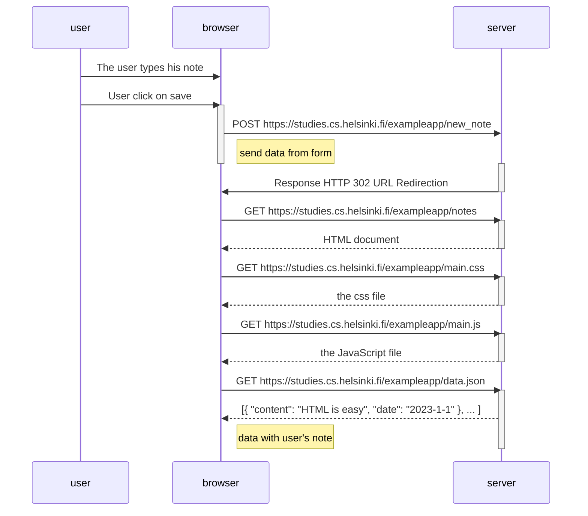
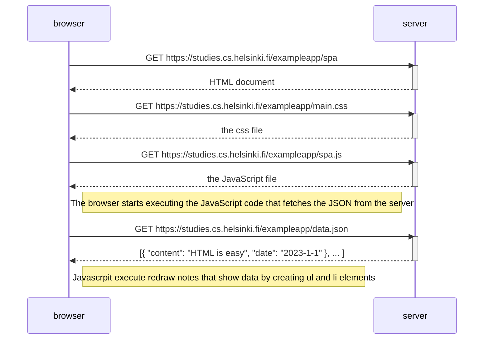
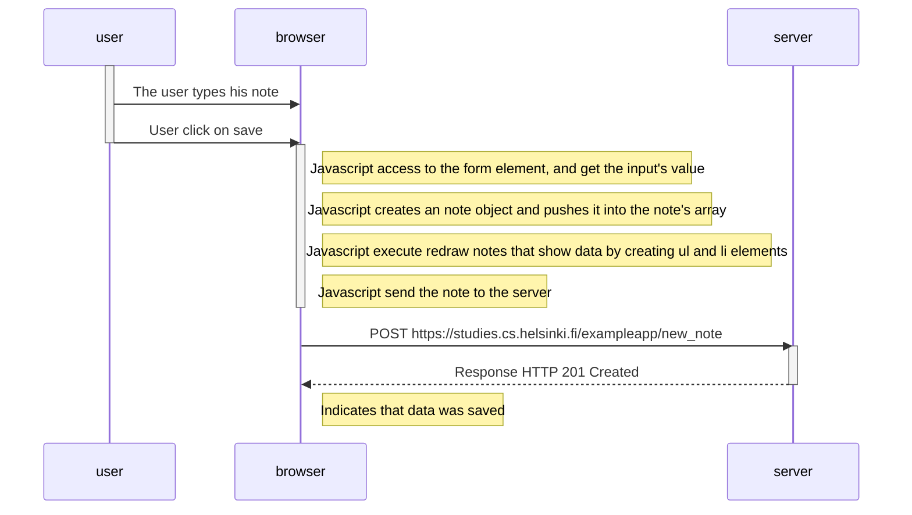

0.4: New note's diagram

```mermaid
sequenceDiagram
    participant user
    participant browser

    user->>browser: The user types his note
    user->>browser: User click on save
   
    activate browser
    browser->>server: POST https://studies.cs.helsinki.fi/exampleapp/new_note
    Note right of browser: send data from form
    deactivate browser

    activate server
    server->>browser: Response HTTP 302 URL Redirection
    deactivate server

    browser->>server: GET https://studies.cs.helsinki.fi/exampleapp/notes


    activate server
    server-->>browser: HTML document
    deactivate server

    browser->>server: GET https://studies.cs.helsinki.fi/exampleapp/main.css
    activate server
    server-->>browser: the css file
    deactivate server

    browser->>server: GET https://studies.cs.helsinki.fi/exampleapp/main.js
    activate server
    server-->>browser: the JavaScript file
    deactivate server

    browser->>server: GET https://studies.cs.helsinki.fi/exampleapp/data.json
    activate server
    server-->>browser: [{ "content": "HTML is easy", "date": "2023-1-1" }, ... ]
    Note right of browser: data with user's note
    deactivate server
```

0.5: SPA's diagram

```mermaid
sequenceDiagram
    participant browser
    participant server

    browser->>server: GET https://studies.cs.helsinki.fi/exampleapp/spa
    activate server
    server-->>browser: HTML document
    deactivate server

    browser->>server: GET https://studies.cs.helsinki.fi/exampleapp/main.css
    activate server
    server-->>browser: the css file
    deactivate server

    browser->>server: GET https://studies.cs.helsinki.fi/exampleapp/spa.js
    activate server
    server-->>browser: the JavaScript file
    deactivate server

    Note right of browser: The browser starts executing the JavaScript code that fetches the JSON from the server

    browser->>server: GET https://studies.cs.helsinki.fi/exampleapp/data.json
    activate server
    server-->>browser: [{ "content": "HTML is easy", "date": "2023-1-1" }, ... ]
    deactivate server

    Note right of browser: Javascrpit execute redraw notes that show data by creating ul and li elements
```

0.6: SPA's new note diagram

```mermaid
sequenceDiagram
    participant user
    participant browser
    participant server

    activate user
    user->>browser: The user types his note
    user->>browser: User click on save
    deactivate user

    activate browser
    Note right of browser: Javascript access to the form element, and get the input's value
    Note right of browser: Javascript creates an note object and pushes it into the note's array
    Note right of browser: Javascript execute redraw notes that show data by creating ul and li elements
    Note right of browser: Javascript send the note to the server

    deactivate browser

    browser->>server: POST https://studies.cs.helsinki.fi/exampleapp/new_note
    activate server
    server-->>browser: Response HTTP 201 Created
    deactivate server
    Note right of browser: Indicates that data was saved
```
